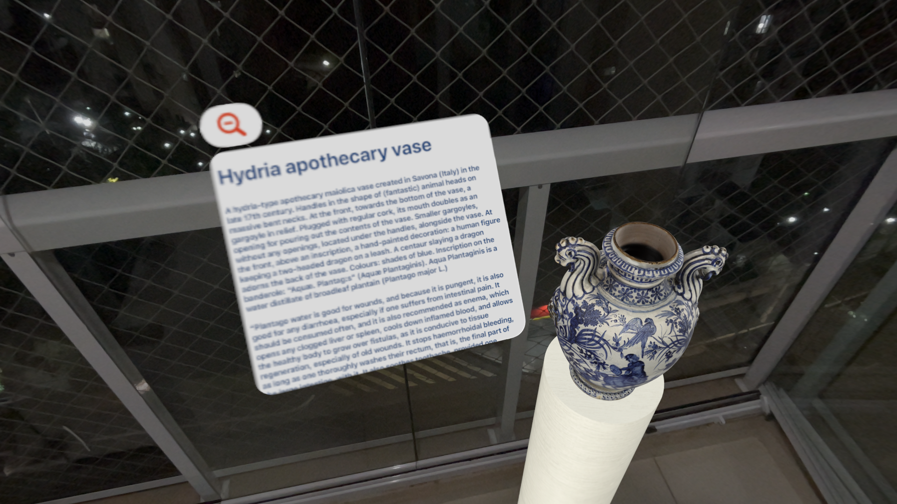

# My Own Museum

*Running on Simulator*

*Running on Device*

## Description

In this app, the user will join an immersive experience organizing and interacting with the pieces of history available in their own Museum.

Once they enter the Museum View, they will be able to place objects in their own room to create a personalized museum at home.

By long-pressing the objects, users can drag and rotate them to create a unique experience in their living room (or even the kitchen if they prefer).

## Project Structure

### File Structure

#### ViewModels (Business Logic)
- **MuseumViewModel:** The core of the app. It contains the logic to control all aspects of the Immersive Space.
- **ARSessionManager:** The auxiliary manager that controls all aspects and access of the ARKit usage.

#### Models

- **InfoModel:** The model of the Info View Screen (attachment).
- **ActiveEntityModel:** The model containing the entity and the values required to drag or rotate the entity.
- **AppState:** The model to control states of the app and the Immersive View.

#### Components

- **InfoView:** The view attached to the entity that displays information about the object.

#### Views

- **MuseumApp:** The main SwiftUI App file, containing the Scene declaration and singleton instantiation.
- **ContentView:** The view that displays the toggle to enter/leave the Immersive Space.
- **ImmersiveView:** The view that displays the Immersive Space content and redirects to the `MuseumViewModel` to manage the behavior of the screen and its content.

#### Enums

- **Items:** The items (objects) the app displays.
- **InfoViewState:** The state of the Info View (showing or hide).

#### Extensions

- **Colors:** A utility extension to map the colors available in the Assets file.

### Project Design

#### The user flow in code

- Once the user opens the app, singleton instances of AppState and MuseumViewModel will be instantiated.
- The user is redirected to the Windows Group containing the ContentView.
- The ContentView gets loaded and after it appears, if running on an actual device, the view will request access to the user’s surroundings.
- After the user grants/denies access, they will be able to start the Museum View by toggling the switch.
- The app will then load the ImmersiveView, passing the MuseumViewModel to the view.
- The MuseumViewModel contains the ARSessionManager to manage access to ARKit features.
- All operations requested on ImmersiveView will be delegated to MuseumViewModel, and if they involve ARKit, the ViewModel will redirect the flow to the ARSessionManager.

### Frameworks and Tools

- **RealityKit:** ImmersiveView management and operations in the virtual space.
- **Reality Composer Pro:** Scene creation and storage/optimization of the USD content.
- **ARKit:** World tracking and anchoring of specified points to the real world.

### Supported Features

- Dynamic fonts for accessibility
- Persisted positioning among sessions
- Additional info on attachments
- Auto-hide Immersive View while the app is inactive
- Easy and visual drag-and-rotate
- Info Views always face the user

### Important Notes

- The Persisted Positioning (aka World Anchors) and the Always Facing View features are not supported on Simulator. All functionalities based on the ARKit framework don’t work on Simulator and will cause a crash if not properly isolated. To test this feature, please build and run the app on a physical device.

## Setup

The app doesn’t require any special setup to build and run.

Just be sure to allow the Immersive Space usage and authorize Surroundings Detection for a full experience.

To move/rotate the objects, long press the desired object until a transparent box appears around it, then drag/rotate the object and place it where and how you want it.

## Known Issues

- Objects pushed by other objects while dragging won’t have their new position persisted.
- The app doesn’t detect walls, so the objects can be dragged beyond walls and over objects like tables.
- The Info View doesn’t have a physical body and may overlay other objects in the virtual space.
- In some rare cases, the object may blink or momentarily disappear while moving it inside the glass box.

## Demo

Check the demo video at Youtube: https://youtu.be/qvMUUy7tPao